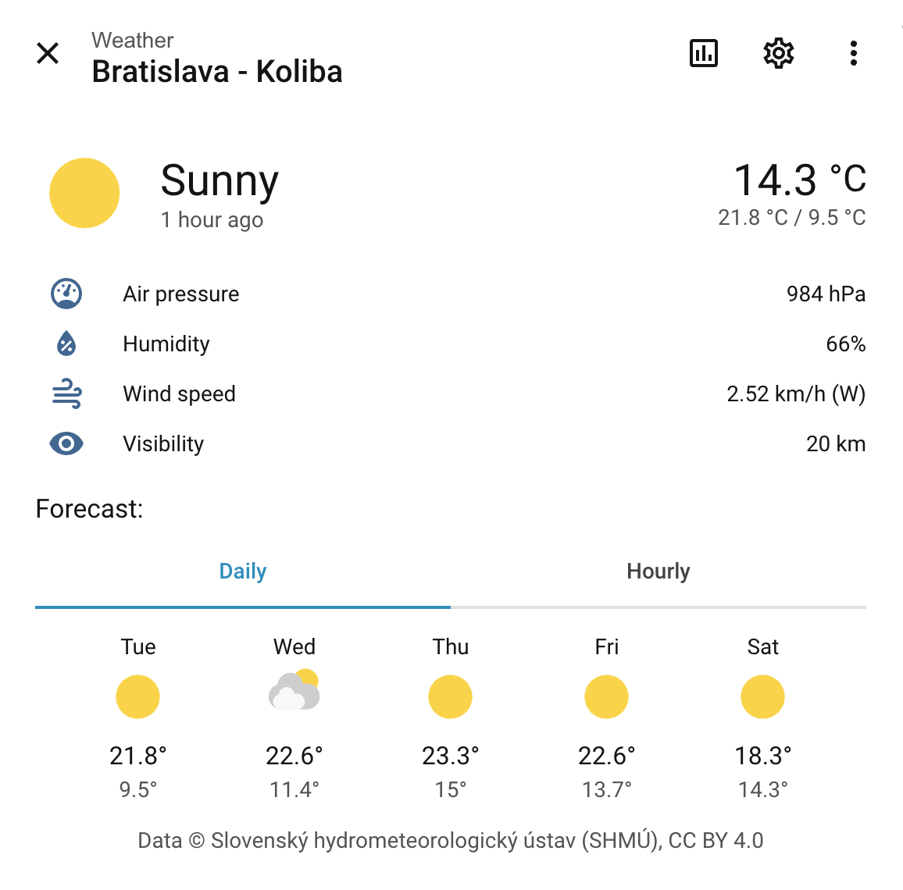
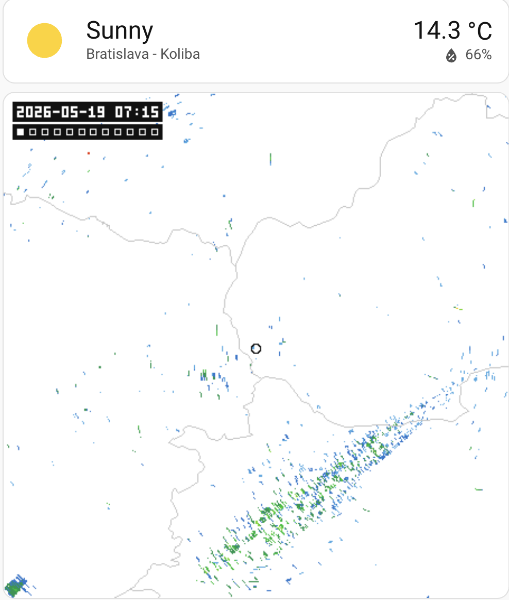

# SHMÚ Weather for Home Assistant

A Home Assistant integration for Slovak weather data published by the
**Slovak Hydrometeorological Institute (SHMÚ)**.

[](https://github.com/vaind/ha-shmu/actions/workflows/ci.yml)
[](https://hacs.xyz/)

> Current conditions, weather warnings, and the ALADIN/SHMÚ daily & hourly
> forecast — decoded from GRIB2 in pure Python, with no native dependency.

## ⚠️ Disclaimer

- This is an **unofficial, community project**. It is **not affiliated with,
  developed by, endorsed by, or supported by the Slovak Hydrometeorological
  Institute (SHMÚ)** in any way. "SHMÚ" is used only to identify the data
  source.
- The integration reads data from public SHMÚ endpoints that have no stable
  API contract; it can break if SHMÚ changes them.
- Provided **"as is", without warranty of any kind. Use at your own risk.**
  Do not rely on it for safety-critical decisions; always consult official
  SHMÚ channels for authoritative weather warnings.

## Screenshots

<table>
<tr>
<td align="center" width="50%">



<sub>**Weather entity** — current conditions, attributes & the daily / hourly forecast</sub>

</td>
<td align="center" width="50%">



<sub>**Radar** — national reflectivity composite cropped to your station</sub>

</td>
</tr>
</table>

## Features

- **Weather entity** — current conditions for a chosen SHMÚ synoptic station.
- **Sensors** — temperature, ground temperature, humidity, pressure (the raw
  station reading), sea-level pressure (that reading reduced to mean sea level,
  comparable between stations), wind speed/gust/bearing, precipitation, snow
  depth, visibility, global radiation, and a warning-level sensor (the raw WMO
  weather code is an opt-in diagnostic).
- **Rain gauge precipitation** — SHMÚ runs a second, roughly three times denser network of automatic rain gauges alongside the synoptic stations: across the country the nearest gauge is a median 10 km away, against 28 km for the nearest synoptic station.
  A separate **Rain gauge precipitation** sensor reports the nearest one, picked from your measurement location, with the gauge's name and distance as attributes.
  It is a *different* network from the station's own **Precipitation** sensor — the two measure different places and are expected to disagree, which is exactly why neither silently stands in for the other.
  If you later move your measurement location and a different gauge becomes the nearest, the sensor keeps its history rather than starting a new one — so a long-term graph spanning that change mixes readings from both gauges, and the gauge named in the attributes is the one in use now, not the one behind older data.
- **Upper air (opt-in)** — a **freezing level** (the height of the 0 °C isotherm above sea level) and the **850 hPa temperature** (the standard air-mass indicator, ~1450 m up), both read from the same ALADIN run that drives the forecast. The freezing level *indicates* the snow line rather than being it: snow keeps falling and melting below the isotherm, so it typically settles a few hundred metres lower, depending on how humid the air below is and how hard it is snowing. Disabled by default — enable them from the device page if you want them.
- **Weather warnings** — a binary sensor (with full alert details as
  attributes) that is on while a SHMÚ CAP alert covers your station, decided
  by the alert's own polygon.
- **Radar** — the national reflectivity composite cropped to your station, as a still image, an autoplaying ~1-hour loop, and a slider-scrubbable frame — plus the same three as bare, geo-referenced overlays you can pan and zoom on a map card (see [Radar](#radar)).
- One shared, change-detecting fetch per cycle, aligned to SHMÚ's upstream
  UTC 5-minute publish grid with an offset that auto-tunes to the observed
  publish lag, so data is fresh rather than up to a poll-interval behind.
  A station that drops out of one snapshot keeps its last reading (no
  flicker) until it is genuinely stale.

## Radar

The SHMÚ national radar reflectivity composite (ODIM_H5, a new frame every ~5 min), decoded in pure Python — no native dependency.
Each frame is rendered two ways from one download: cropped to the vicinity of your configured station, with country borders and a station marker drawn on so the picture is self-locating in a plain card; and whole-country at native resolution with no decoration, for [draping over a map card](#zoomable-radar-on-a-map).
It is **national data**, so the radar entities stay available even if your station momentarily drops out of an observation snapshot.
The colour ramp is reflectivity (rain/storm intensity); this is *not* cloud cover.

Entities (grouped under the station device; `<station>` is your station's slug, e.g. `bratislava_letisko`):

| Entity | What it shows |
|---|---|
| `image.<station>_radar` | The **latest** single frame. Attributes: `product`, `max_dbz` (peak reflectivity — a handy "is it raining?" signal), `center_*` and `bbox_*` for map overlays. |
| `image.<station>_radar_loop` | An **autoplaying ~1-hour loop** (the last 12 frames, animated PNG). Every frame is stamped with its valid time in your Home Assistant timezone, plus a row of step markers under it that fills in across the hour and resets when the loop wraps. |
| `image.<station>_radar_frame` | A **single buffered frame**, chosen by the scrubber below — for manually stepping through the loop. |
| `number.<station>_radar_frame_selector` | The **scrubber** (slider). Reads like a timeline: `0` on the **right** is live/newest; drag **left** into the past — `-1` ≈ 5 min ago … down to `-(frames-1)` for the oldest buffered frame. |
| `image.<station>_radar_map` | The latest frame **for a map card**: the whole country at the radar's native ~0.3 km resolution, with nothing drawn on it and transparent where there is no echo. `bbox_*` is the composite's own corners, and `max_dbz` is the strongest echo *anywhere in the country* rather than near your station. |
| `image.<station>_radar_map_loop` | The same ~1-hour loop, for a map card. It carries no timestamp and no step markers: a map overlay is drawn in ground coordinates, so anything baked into a corner of the picture would sit in the terrain and stretch with the zoom. The entity's state is the newest frame's time. |
| `image.<station>_radar_map_frame` | The scrubbed frame, for a map card — driven by the same slider as `radar_frame`. |

### Example dashboard card

A plain Lovelace card — no custom frontend resources — pairing the
scrubbable frame with its slider:

```yaml
type: vertical-stack
cards:
  - type: picture-entity
    entity: image.<station>_radar_frame
    show_state: false
    show_name: false
  - type: entities
    entities:
      - entity: number.<station>_radar_frame_selector
```

For a hands-off "just watch it move" view, use `image.<station>_radar_loop`
in a plain `picture-entity` card instead — it animates on its own.

### Zoomable radar on a map

The pictures above are fixed crops, so there is nothing to zoom into.
The `*_radar_map*` entities are the same frames rendered for a map instead: the whole national composite at the radar's own resolution, undecorated, and geo-referenced by the `bbox_*` attributes.
Draping one over a Leaflet map card gives you pan and zoom, and sets the echo against towns, roads and terrain — none of which a radar picture can show on its own, since all the picture cards draw for reference is country borders and a marker at your station.

This needs one custom card — [ha-map-card](https://github.com/nathan-gs/ha-map-card) by nathan-gs — which you install once from HACS (*Frontend* → search for **Map card**).
The plugin that puts the radar on it **ships with this integration** and is served at `/shmu_static/radar-map-overlay.js`, so there is nothing else to download and no Lovelace resource to register.

```yaml
type: custom:map-card
focus_entity: zone.home # centre on your Home Assistant location
zoom: 8
card_size: 8
entities:
  - zone.home # optional: also draw a marker there
plugins:
  - name: shmu-radar
    url: /shmu_static/radar-map-overlay.js
    options:
      entity: image.<station>_radar_map_loop
      opacity: 0.6
```

The card has no home-location default of its own, so give it `focus_entity` (or fixed coordinates).
With neither, it fits the bounds of the entity markers you listed and *ignores* `zoom` — which for a single marker means it opens at street level, far too close for a radar view.
To pin the view somewhere other than home, use `x` and `y` instead: `x` is the **latitude** and `y` the longitude, whichever way round the card's own option table lists them.

Plugin options: `entity` (required) is any of the three map entities, `opacity` defaults to `0.6`, and `attribution` overrides the SHMÚ credit shown in the map's corner.
Point `entity` at `image.<station>_radar_map_frame` and add the scrubber card to the same view to step through the last hour on the map.

Two things worth knowing before you leave it on a wall dashboard.
The animated map loop is ~330 KB and the browser re-fetches it every 5 minutes while the card is open, so prefer `image.<station>_radar_map` (~30 KB, still) where bandwidth matters.
Overlay alignment is exact rather than approximate: the SHMÚ grid and web maps are both spherical Mercator, so stretching the picture between its reported corners puts every pixel where the map itself would put that coordinate.

## Installation (HACS)

This integration relies on the SHMÚ website for the current sky condition (the
open-data files contain no cloud information — see
[Why HACS](CONTRIBUTING.md#why-hacs-and-not-home-assistant-core)), so it is
distributed via HACS rather than Home Assistant core.

It is part of the **default HACS store** — no custom repository needed.

1. HACS → search for **SHMÚ Weather** → *Download*, then restart Home
   Assistant.

   [](https://my.home-assistant.io/redirect/hacs_repository/?owner=vaind&repository=ha-shmu&category=integration)

2. *Settings → Devices & Services → Add Integration → SHMÚ Weather*. The
   station nearest your Home Assistant location is preselected; pick any of
   the 27 synoptic stations. Add the integration again for more stations.

   [](https://my.home-assistant.io/redirect/config_flow_start/?domain=shmu)

## Removing the integration

1. *Settings → Devices & Services → SHMÚ Weather → ⋮ → Delete* for each
   configured station. This removes its device, entities and history.
2. Optionally, in HACS → *SHMÚ Weather* → ⋮ → *Remove*, then restart Home
   Assistant to delete the integration files.

No external account or credential exists, so nothing else needs cleaning up.

## Data source & attribution

Weather and climate data © **Slovenský hydrometeorologický ústav (SHMÚ)**,
provided via <https://opendata.shmu.sk/> under
[CC BY 4.0](https://creativecommons.org/licenses/by/4.0/). This project is not
affiliated with or endorsed by SHMÚ.

## License

Code is MIT licensed (see [LICENSE](LICENSE)). SHMÚ data retains its CC BY 4.0
license and must be attributed accordingly.
